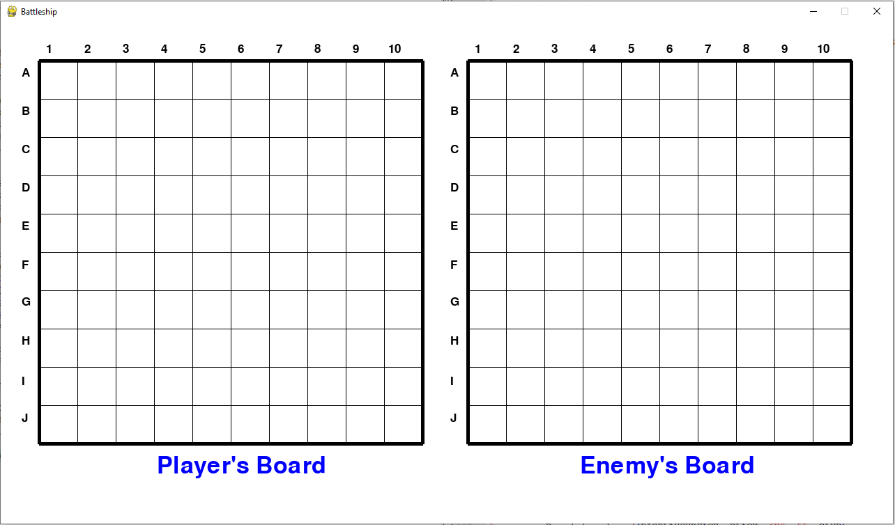
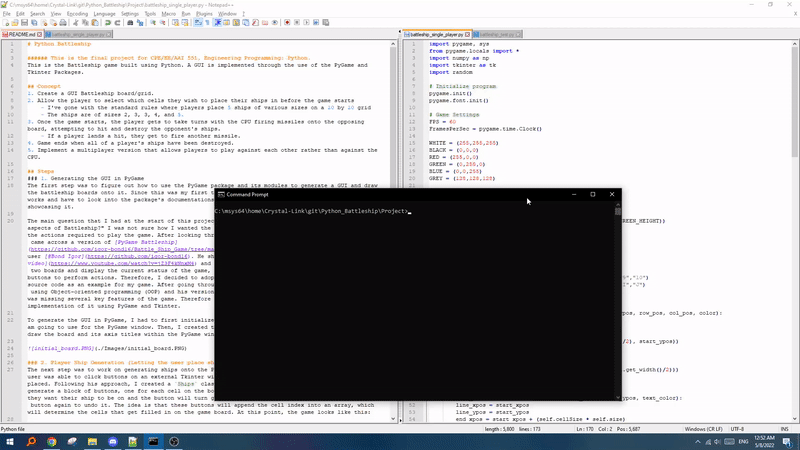
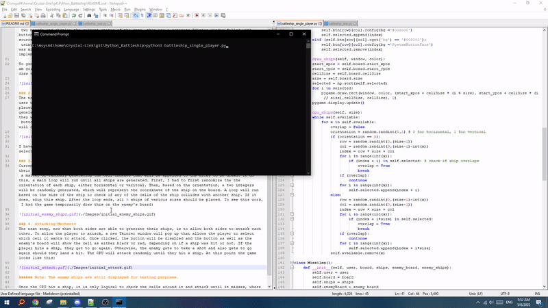
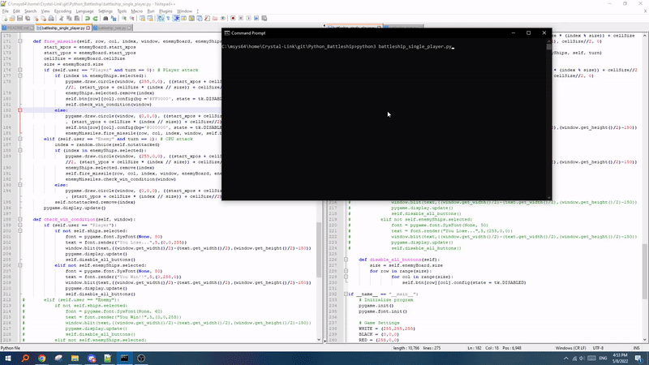

# Python Battleship

###### This is the final project for CPE/EE/AAI 551, Engineering Programming: Python.
This is the Battleship game built using Python. A GUI is implemented through the use of the PyGame and Tkinter Packages.

## Concept
1. Create a GUI Battleship board/grid.
2. Allow the player to select which cells they wish to place their ships in before the game starts
	- I've gone with the standard rules where players place 5 ships of various sizes on a 10 by 10 grid
	- The ships are of sizes 2, 3, 3, 4, and 5.
3. Once the game starts, the player gets to take turns with the CPU firing missiles onto the opposing board, attempting to hit and destroy the opponent's ships.
	- If a player lands a hit, they get to fire another missile.
4. Game ends when all of a player's ships have been destroyed.
5. Implement a multiplayer version that allows players to play against each other rather than against the CPU.

## Steps
### 1. Generating the GUI in PyGame
The first step was to figure out how to use the PyGame package and its modules to generate a GUI and draw the battleship boards onto it. Since this was my first time using PyGame, I was not familiar with how it works and have to look into the package's documentations as well as look for some video tutorials showcasing it. 

The main question that I had at the start of this project was "How am I going to implement the different aspects of Battleship?" I was not sure how I wanted the game to look and how I wanted the user to perform the actions required to play the game. After looking through several PyGame tutorials and featured games, I came across a version of [PyGame Battleship](https://github.com/igor-bond16/Battle_Ship_Game/tree/master/Battle%20Ship%20Complete) created by Japanese user [@Bond Igor](https://github.com/igor-bond16). He showcased his version of Battleship in a [YouTube video](https://www.youtube.com/watch?v=jZ3F4kNnxM4) and I really loved his idea of using PyGame to draw the two boards and display the current status of the game, then use a separate Tkinter window filled with buttons to perform actions. Therefore, I decided to adopt his implementation of Battleship and use his source code as an example for my game. After going through his source code, I noticed that it was not coded using Object-oriented programming (OOP) and his version of Battleship strayed from the standard rules and was missing several key features of the game. Therefore I am only going to refer to his game for the implementation of it using PyGame and Tkinter.

To generate the GUI in PyGame, I had to first initialize PyGame, as well as the variables/settings that I am going to use for the PyGame window. Then, I created the `Board` class which includes the functions to draw the board and its axis titles within the PyGame window. At this point, the game looks like this:

### 2. Player Ship Generation (Letting the user place ships on the board)
The next step was to work on generating ships onto the PyGame board. Remember that in Igor's version, the user was able to click buttons on an external Tkinter window to determine where the player's ships will be placed. Following his approach, I created a `Ships` class that initializes a Tkinter instance and have it generate a block of buttons, one for each cell on the board. The user will be able to click on the cell they want their ship to be on and the button will turn green. If they change their mind, they can click the button again to undo it. The idea is that these buttons will append the cell index into an array, which will determine the cells that get filled in on the game board. At this point, the game looks like this:

I have not yet constrained the cells that the player is able to select (since they should only be able to select the cells for their 5 ships), but I will implement that at a later step.

### 3. Enemy Ship Generation (Single-Player)
Currently, the game is single-player, therefore the enemy (in this case, CPU), must be able to generate their 5 ships randomly. Since I had already set up the method to draw the ships onto the board, it was just a matter of randomly generating the cell indexes that will be appended to the array to be drawn. To do this, a main loop will run until all ships are generated. First, I had to first randomize the the orientation of each ship, either horizontal or veritcal. Then, based on the orientation, a two integers will be randomly generated, which will represent the coordinate of the ship on the board. A loop will run based on the size of the ship to check if any of the cells of the ship collides with another ship. If it does, skip this ship. After the loop ends, all 5 ships of various sizes should be placed. To see this work, I had the game temporarily draw this on the enemy's board:

### 4. Attacking Mechanic
The next step, now that both sides are able to generate their ships, is to allow both sides to attack each other. To allow the player to attack, a new Tkinter window will pop up that allows the player to select which cell it wants to attack. Once clicked, the button will be disabled and the button as well as the enemy's board will show the cell as either black or red, depending on if a ship was hit or not. If the player hits a ship, they get to go again. Otherwise, the enemy gets to take a shot and also gets to go again should they land a hit. The CPU will attack randomly until they hit a ship. At this point the game looks like this:

###### Note: The enemy ships are still displayed for testing purposes.

Once the CPU hit a ship, it is only logical to check the cells around it and attack until it misses, where then it should check the other direction until the ship is destroyed. For now, the CPU only attacks randomly. This will be implemented at a later step.

### 5. Win Condition!
The final step for the base game would be to check for the win condition. This means, once either side's ships are all destroyed, the game ends and the player either wins or loses. To do this, I created a `check_win_condition` function which will get called after every successful hit. It checks if there are any remaining indices left inside both user's `selected` array (a.k.a. if there are any ship cells still alive). If either user's `selected` array is empty, then all of their ships have been destroyed and the opponent is declared the winner. A text that would either be "You Lose..." or "You Win!" is rendered and is displayed on the game window and all of the Tkinter buttons will be disabled. The game now looks like this:

